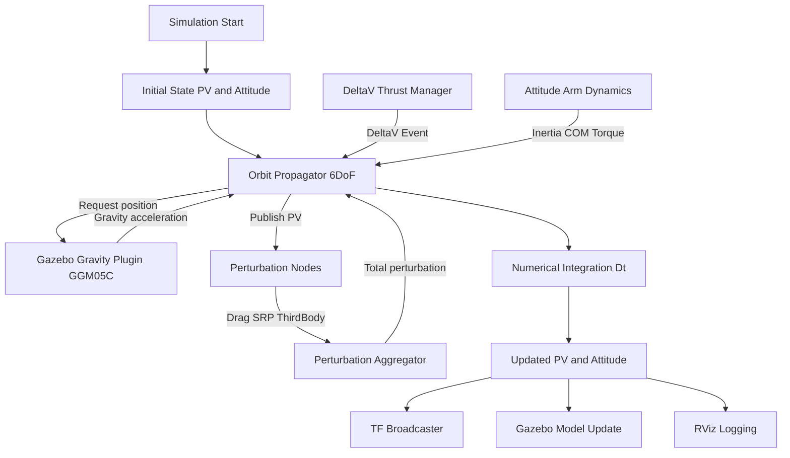
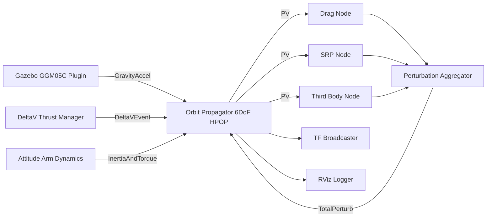
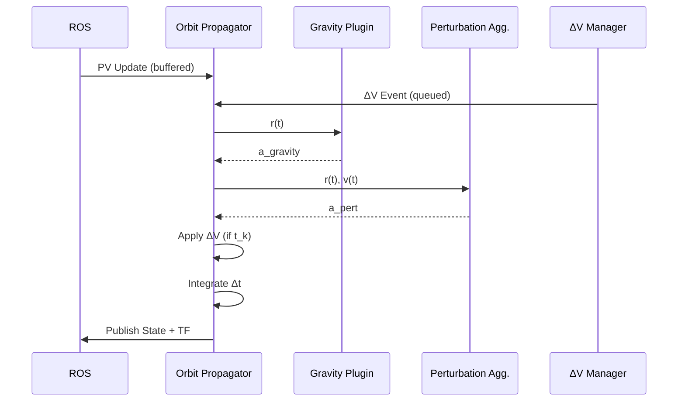

## ROS2-Based LEO Satellite & Robotic Arm Integrated Simulation

### 1. Executive Summary

This project builds a high-fidelity simulation platform integrating ROS2 and Gazebo for LEO satellite dynamics and a satellite-mounted robotic arm. It includes real-time orbit propagation using HPOP (or optional SGP4), satellite attitude and manipulator dynamics, coupled dynamics, and environmental physics including position-dependent gravity using GGM05C, atmospheric drag, and solar radiation.

### 2. Background & Motivation

* Robotic arms are essential for space services (repair, assembly, cargo handling).
* Ground verification requires combined orbit propagation and manipulator dynamics.
* Gazebo alone cannot simulate high-precision orbital motion or LEO gravity accurately.

### 3. Objectives

1. HPOP-based real-time orbit propagator ROS2 node
2. Orbit-to-Gazebo bridge for model updates
3. Satellite + 6-DoF manipulator URDF/SDF modeling
4. Coupled dynamics simulation (arm torque → satellite attitude)
5. Verification scenarios: approach, grasp, manipulation

### 4. Scope & Assumptions

Synchronization
* HPOP publish: 10 Hz (dt=0.1s)
* Gazebo update: faster than HPOP
* Frames: ECI → Gazebo world (or ENU)
Development Environment
* Ubuntu 22.04
* ROS2 Humble
* Gazebo
* MoveIt2
* C++ (plugins), Python (nodes)

### 5. System Architecture
#### 5.1 End-to-End Flow


#### 5.2 ROS Node Graph



#### 5.3 Integration sequenceDiagram



**Components:**

1. Orbit Propagator Node (HPOP)
2. Orbit-to-Gazebo Bridge → ECI → Gazebo conversion
3. Gazebo World & Plugins → ModelPlugin, WorldPlugin
4. Satellite & Manipulator → URDF/SDF with 6-DoF arm
5. Control Stack → Arm + Satellite attitude controller
6. Visualization & Logging → RViz, Gazebo GUI, CSV/rosbag

**Data Flow:**

```
Initial state → HPOP → (r,v) → ECI→Gazebo → Plugin → Satellite Pose → Physics → Arm Controller → Joint Torques → Reaction → Next Step
```

### 6. Messages & Interfaces

#### 6.1 Orbit Propagator (Core Node)

##### Package
`orbit_propagator_hpop`

##### Node
`orbit_propagator_node`

The orbit propagator is the **single source of truth** for translational and rotational state.  
All forces, perturbations, and maneuvers are applied **only at numerical integration boundaries**.

---

##### Subscribed Topics

| Topic | Type | Publisher (Node / Package) | Description |
|---|---|---|---|
| `/gravity_accel` | `geometry_msgs/Vector3` | `ggm05c_plugin / gazebo_gravity_ggm05c` | Earth gravity acceleration from Gazebo |
| `/perturbation_accel` | `geometry_msgs/Vector3` | `perturbation_aggregator / perturbation_nodes` | Aggregated non-gravitational perturbations |
| `/delta_v_event` | `orbit_msgs/DeltaVEvent` | `maneuver_manager_node` | Impulsive maneuver event |
| `/thrust_cmd` | `orbit_msgs/ThrustCmd` | `maneuver_manager_node` | Finite thrust command |
| `/attitude_state` | `geometry_msgs/Pose` | `attitude_dynamics_node` | Current satellite attitude |
| `/inertia_update` | `orbit_msgs/Inertia` | `attitude_dynamics_node` | Updated inertia due to arm motion |
| `/external_pv_update` | `nav_msgs/Odometry` | (Optional) OD / EKF | External state correction |

---

##### Published Topics

| Topic | Type | Subscribers |
|---|---|---|
| `/orbit/pv_state` | `nav_msgs/Odometry` | Perturbation nodes |
| `/orbit/propagated_state` | `nav_msgs/Odometry` | TF, RViz, logging |
| `/orbit/accel_total` | `geometry_msgs/Vector3` | Debug / analysis |
| `/orbit/integration_status` | `std_msgs/String` | Logging |

---

#### 6.2 Gazebo Gravity Plugin (GGM05C)

##### Package
`gazebo_gravity_ggm05c`

### Plugin
`GGM05CGravityPlugin`

---

##### Published Topics

| Topic | Type | Description |
|---|---|---|
| `/gravity_accel` | `geometry_msgs/Vector3` | Earth gravity acceleration computed using GGM05C |

**Note**  
The Gazebo plugin never modifies the state directly.  
It only provides sampled force information.

---

#### 6.3 Perturbation Modeling

##### Package
`perturbation_nodes`

---

##### Subscribed Topics (All Perturbation Nodes)

| Topic | Type |
|---|---|
| `/orbit/pv_state` | `nav_msgs/Odometry` |

---

##### Published Topics (Individual Nodes)

| Node | Topic | Type |
|---|---|---|
| `drag_node` | `/drag_accel` | `geometry_msgs/Vector3` |
| `srp_node` | `/srp_accel` | `geometry_msgs/Vector3` |
| `third_body_node` | `/third_body_accel` | `geometry_msgs/Vector3` |

---

##### Perturbation Aggregator

###### Node
`perturbation_aggregator`

| Direction | Topic |
|---|---|
| Subscribe | `/drag_accel` |
| Subscribe | `/srp_accel` |
| Subscribe | `/third_body_accel` |
| Publish | `/perturbation_accel` |

---

#### 6.4 Maneuver and Delta-V Management

##### Package
`maneuver_manager`

##### Node
`maneuver_manager_node`

---

##### Published Topics

| Topic | Type | Description |
|---|---|---|
| `/delta_v_event` | `orbit_msgs/DeltaVEvent` | Time-tagged impulsive maneuver |
| `/thrust_cmd` | `orbit_msgs/ThrustCmd` | Finite-duration thrust |

Maneuver events are buffered and applied **only at integration boundaries**  
to preserve numerical stability.

---

#### 6.5 Attitude and Robotic Arm Dynamics

##### Package
`attitude_dynamics`

##### Node
`attitude_dynamics_node`

---

##### Subscribed Topics

| Topic | Publisher |
|---|---|
| `/joint_states` | MoveIt2 |
| `/move_group/status` | MoveIt2 |

---

##### Published Topics

| Topic | Type | Description |
|---|---|---|
| `/attitude_state` | `geometry_msgs/Pose` | Satellite attitude |
| `/inertia_update` | `orbit_msgs/Inertia` | Updated inertia tensor |
| `/torque_effect` | `geometry_msgs/Vector3` | Torque induced by arm motion |

---

#### 6.6 MoveIt2 Robotic Arm

##### Package
`moveit_sat_arm`

##### Nodes
- `move_group`
- `robot_state_publisher`

---

##### Published Topics

| Topic | Type |
|---|---|
| `/joint_states` | `sensor_msgs/JointState` |
| `/tf` | TF |
| `/tf_static` | TF |

---

##### Subscribed Topics (Optional)

| Topic | Purpose |
|---|---|
| `/orbit/propagated_state` | Frame synchronization |

---

#### 6.7 TF Management

##### Package
`tf_manager`

##### Node
`orbit_tf_broadcaster`

---

##### Subscribed Topics

| Topic | Source |
|---|---|
| `/orbit/propagated_state` | Orbit Propagator |
| `/attitude_state` | Attitude Dynamics |

---

##### Published Topics

| Topic | Type |
|---|---|
| `/tf` | TF |
| `/tf_static` | TF |

### 7. Physics & Gravity Modeling

**Earth Gravity Potential (GOCO2025s):**

$$
V(r, \phi, \lambda) = \frac{GM}{r} \left[1 + \sum_{n=2}^{n_{max}} \left(\frac{a}{r}\right)^n \sum_{m=0}^{n} \bar{P}*{n,m}(\sin \phi)(\bar{C}*{n,m}\cos(m\lambda) + \bar{S}_{n,m}\sin(m\lambda))\right]
$$


**Fully-Normalized Associated Legendre Functions:**

$$
\bar{P}*{n,m}(x) = N*{n,m} P_{n,m}(x),\quad N_{n,m} = \sqrt{(2-\delta_{m0})(2n+1)\frac{(n-m)!}{(n+m)!}}
$$


**Gravitational Acceleration:**

$$
\mathbf{a} = -\nabla V
$$

Components:

$$
a_r = -\frac{\partial V}{\partial r},\quad a_\phi = -\frac{1}{r} \frac{\partial V}{\partial \phi},\quad a_\lambda = -\frac{1}{r\cos\phi} \frac{\partial V}{\partial \lambda}
$$


**Spherical → Cartesian:**

$$
\begin{aligned}
a_x &= a_r \cos\phi \cos\lambda - a_\phi \sin\phi \cos\lambda - a_\lambda \sin\lambda \
a_y &= a_r \cos\phi \sin\lambda - a_\phi \sin\phi \sin\lambda + a_\lambda \cos\lambda \
a_z &= a_r \sin\phi + a_\phi \cos\phi
\end{aligned}
$$


**Force in Gazebo:**

$$
\mathbf{F} = m \mathbf{a}
$$


**Coupled Satellite-Arm Dynamics:** Arm motion induces torque on satellite. Use HPOP for CoM orbit, Gazebo for attitude + arm, ModelPlugin for reaction.


### 8. Build & Run

```bash
colcon build --packages-select satellite_description satellite_plugins satellite_control satellite_moveit satellite_utils gazebo_leo_gravity
source install/setup.bash
ros2 launch satellite_sim satellite_sim.launch.py
```
