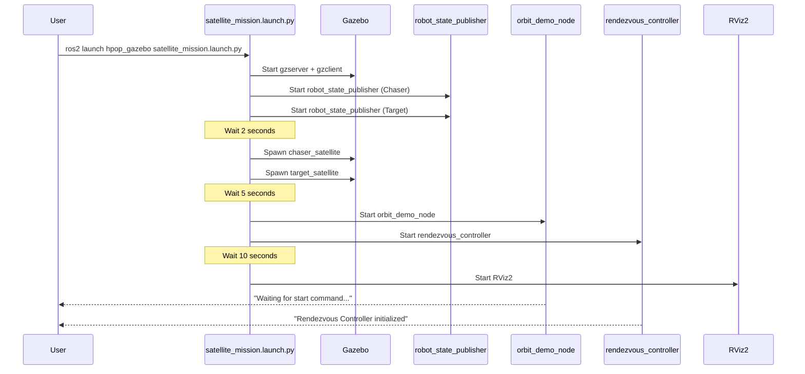
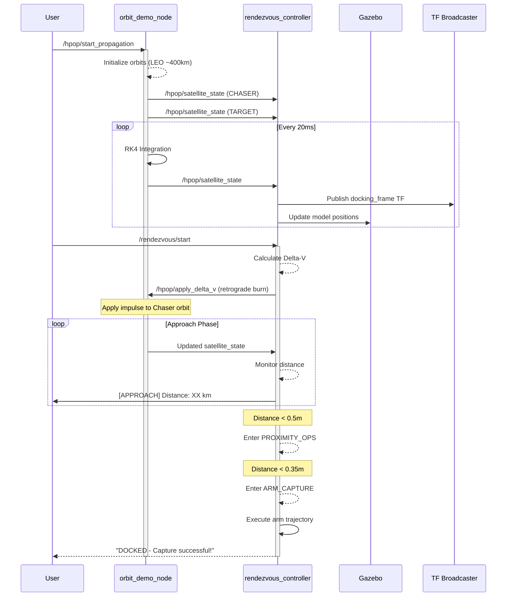
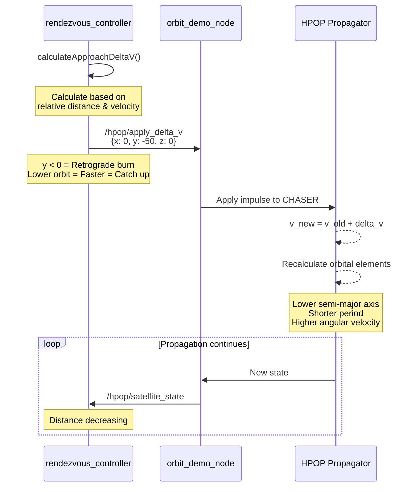
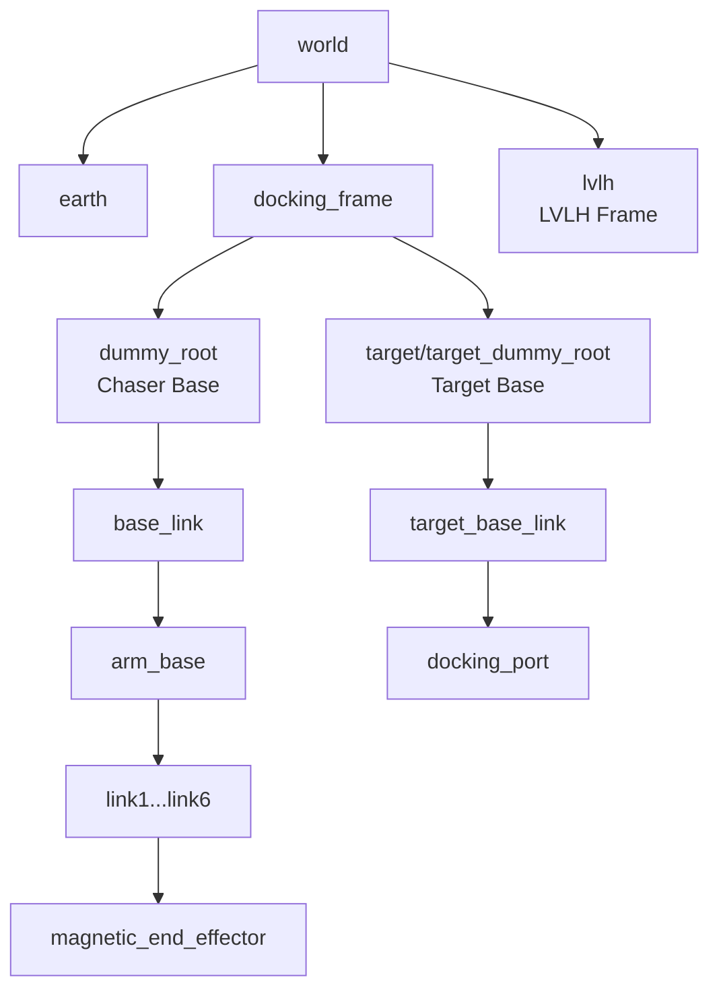
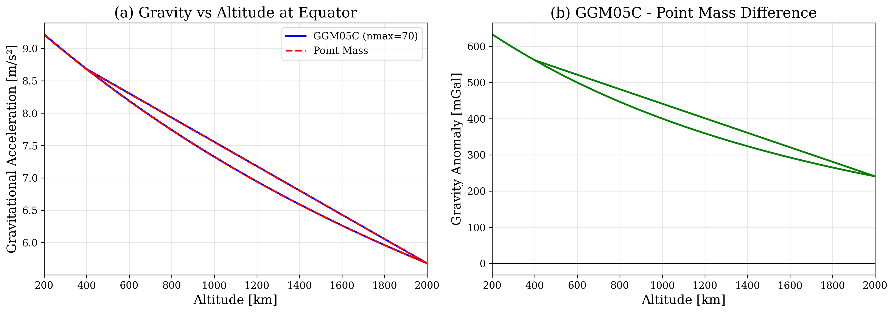
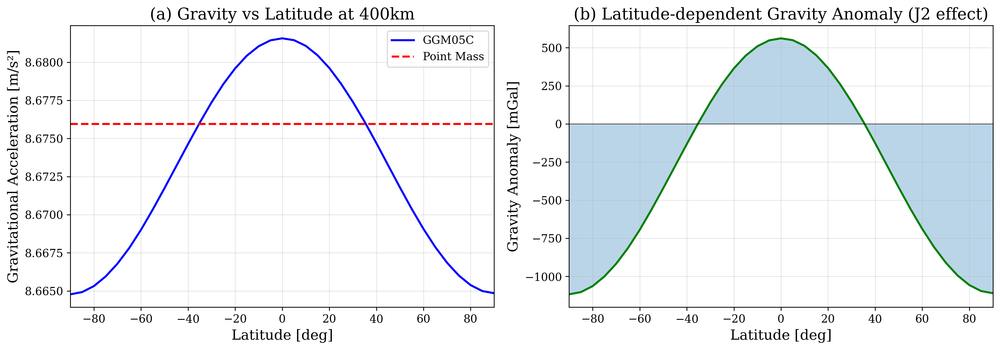
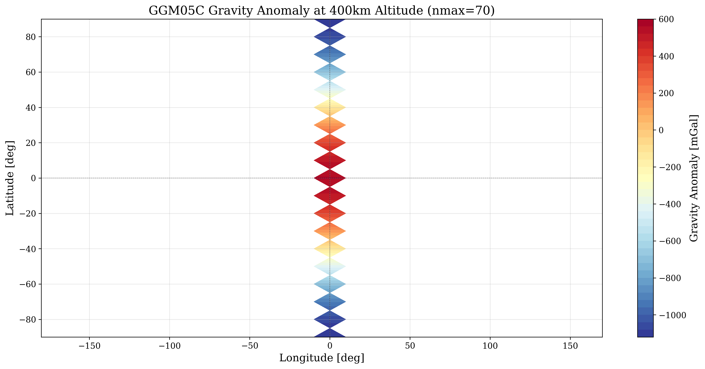
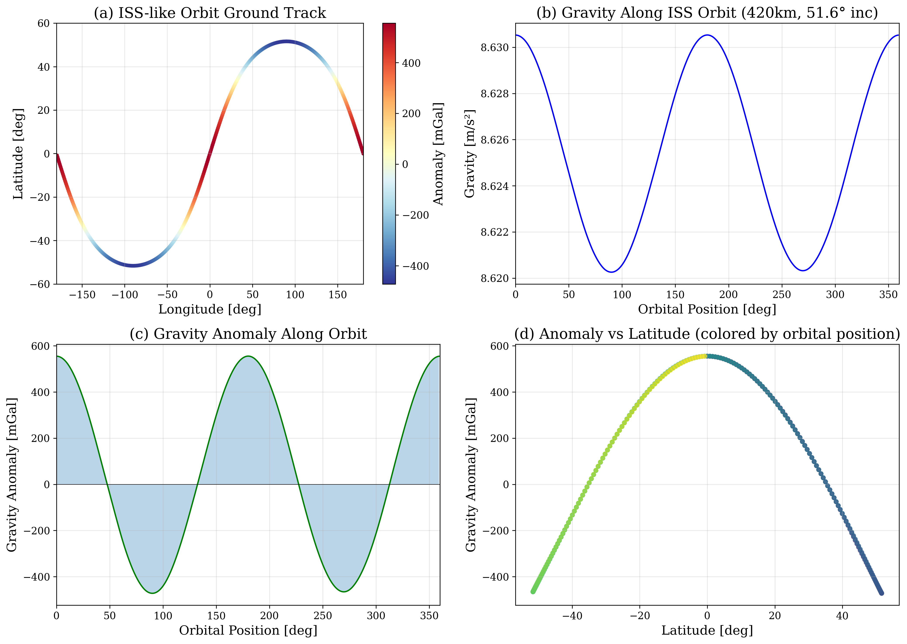
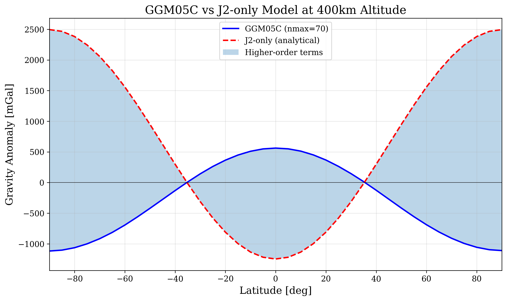

# HPOP System: High Precision Orbit Propagator for Satellite Rendezvous and Docking Simulation

## Overview

HPOP System은 ROS2 기반의 고정밀 궤도 전파기(High Precision Orbit Propagator)와 위성 랑데부-도킹 시뮬레이션 시스템입니다. Gazebo 물리 시뮬레이터와 통합되어 실시간 궤도 역학 계산, 로봇팔 제어, 시각화를 제공합니다.

## System Architecture

```
┌─────────────────────────────────────────────────────────────────────────────┐
│                           HPOP System Architecture                          │
├─────────────────────────────────────────────────────────────────────────────┤
│                                                                             │
│  ┌──────────────┐    ┌──────────────┐    ┌──────────────┐                  │
│  │  hpop_core   │    │hpop_perturb  │    │  hpop_msgs   │                  │
│  │              │◄───│  ations      │    │              │                  │
│  │ Orbit Prop.  │    │              │    │ ROS2 Msgs    │                  │
│  │ RK4/RK78     │    │ J2-J6, Drag  │    │ & Services   │                  │
│  └──────┬───────┘    │ SRP, 3rdBody │    └──────────────┘                  │
│         │            └──────────────┘                                       │
│         ▼                                                                   │
│  ┌──────────────┐    ┌──────────────┐    ┌──────────────┐                  │
│  │orbit_demo_   │───►│rendezvous_   │───►│   Gazebo     │                  │
│  │    node      │    │ controller   │    │  Simulator   │                  │
│  │              │    │              │    │              │                  │
│  │ HPOP Engine  │    │ Delta-V Ctrl │    │ 3D Physics   │                  │
│  └──────────────┘    └──────────────┘    └──────────────┘                  │
│         │                   │                   │                          │
│         ▼                   ▼                   ▼                          │
│  ┌─────────────────────────────────────────────────────────────┐           │
│  │                        RViz2 Visualization                   │           │
│  │  ┌─────────────┐  ┌─────────────┐  ┌─────────────────────┐  │           │
│  │  │ Orbit View  │  │ Docking View│  │ Mission Control     │  │           │
│  │  │ (LVLH)      │  │ (Real Scale)│  │ Panel               │  │           │
│  │  └─────────────┘  └─────────────┘  └─────────────────────┘  │           │
│  └─────────────────────────────────────────────────────────────┘           │
└─────────────────────────────────────────────────────────────────────────────┘
```

## Package Structure

```
hpop_system/
├── hpop_core/           # 핵심 궤도 전파 라이브러리
├── hpop_perturbations/  # 섭동력 계산 (J2-J6, Drag, SRP, 3rd Body)
├── hpop_msgs/           # ROS2 메시지, 서비스, 액션 정의
├── hpop_gazebo/         # Gazebo 시뮬레이션 및 랑데부 제어
├── hpop_rviz_plugins/   # RViz2 시각화 플러그인
├── hpop_export/         # 궤도 데이터 내보내기 (CCSDS OEM)
├── hpop_tle/            # TLE 데이터 처리
├── hpop_maneuver/       # 기동 계획 및 실행
├── hpop_analysis/       # 궤도 분석 도구
└── hpop_bringup/        # 시스템 런치 파일
```

## Nodes

### 1. orbit_demo_node (hpop_core)
HPOP 궤도 전파 엔진을 실행하는 메인 노드

| 항목 | 내용 |
|------|------|
| Package | hpop_core |
| Executable | orbit_demo_node |
| 역할 | 두 위성(Chaser, Target)의 궤도 전파 및 상태 발행 |

**Published Topics:**
| Topic | Type | Description |
|-------|------|-------------|
| `/hpop/satellite_state` | `hpop_msgs/SatelliteState` | 위성 상태 (위치, 속도, 궤도요소) |
| `/hpop/satellite_markers` | `visualization_msgs/MarkerArray` | ECI 궤도 마커 |
| `/hpop/chaser_orbit_path` | `nav_msgs/Path` | Chaser 궤도 경로 |
| `/hpop/target_orbit_path` | `nav_msgs/Path` | Target 궤도 경로 |
| `/lvlh/satellite_markers` | `visualization_msgs/MarkerArray` | LVLH 상대운동 마커 |
| `/lvlh/relative_path` | `nav_msgs/Path` | 상대 운동 경로 |
| `/lvlh/distance_text` | `visualization_msgs/Marker` | 거리 텍스트 표시 |

**Subscribed Topics:**
| Topic | Type | Description |
|-------|------|-------------|
| `/hpop/apply_delta_v` | `geometry_msgs/Vector3` | Delta-V 명령 (LVLH 좌표계) |

**Services:**
| Service | Type | Description |
|---------|------|-------------|
| `/hpop/start_propagation` | `std_srvs/Trigger` | 궤도 전파 시작 |
| `/hpop/stop_propagation` | `std_srvs/Trigger` | 궤도 전파 중지 |
| `/hpop/reset_propagation` | `std_srvs/Trigger` | 초기 상태로 리셋 |

---

### 2. rendezvous_controller (hpop_gazebo)
랑데부 및 도킹 제어 노드

| 항목 | 내용 |
|------|------|
| Package | hpop_gazebo |
| Executable | rendezvous_controller |
| 역할 | 접근 기동 계획, Delta-V 계산, 로봇팔 제어 |

**Published Topics:**
| Topic | Type | Description |
|-------|------|-------------|
| `/rendezvous/status` | `std_msgs/String` | 미션 상태 |
| `/rendezvous/distance` | `std_msgs/Float64` | 현재 거리 (m) |
| `/rendezvous/delta_v` | `geometry_msgs/Twist` | 적용된 Delta-V |
| `/tf` | `tf2_msgs/TFMessage` | 좌표 변환 (docking_frame) |

**Subscribed Topics:**
| Topic | Type | Description |
|-------|------|-------------|
| `/hpop/satellite_state` | `hpop_msgs/SatelliteState` | HPOP 위성 상태 |
| `/gazebo/model_states` | `gazebo_msgs/ModelStates` | Gazebo 모델 상태 |
| `/joint_states` | `sensor_msgs/JointState` | 로봇팔 관절 상태 |

**Services:**
| Service | Type | Description |
|---------|------|-------------|
| `/rendezvous/start` | `std_srvs/Trigger` | 랑데부 시퀀스 시작 |
| `/rendezvous/abort` | `std_srvs/Trigger` | 랑데부 중단 |
| `/rendezvous/capture` | `std_srvs/Trigger` | 포획 시퀀스 시작 |

---

## Message Definitions

### hpop_msgs/SatelliteState
```
std_msgs/Header header
string satellite_id          # 위성 식별자 ("CHASER", "TARGET")
string frame_id              # 좌표계 (ECI_J2000)

geometry_msgs/Point position          # [m] 위치 벡터
geometry_msgs/Vector3 velocity        # [m/s] 속도 벡터
geometry_msgs/Quaternion orientation  # 자세 쿼터니언
geometry_msgs/Vector3 angular_velocity # [rad/s] 각속도

hpop_msgs/OrbitalElements elements    # 궤도 요소
float64 mass                          # [kg] 질량
float64 drag_coefficient              # 항력 계수
bool is_valid                         # 유효성 플래그
```

### hpop_msgs/OrbitalElements
```
float64 semi_major_axis      # [m] 장반경
float64 eccentricity         # [-] 이심률
float64 inclination          # [rad] 궤도경사각
float64 raan                 # [rad] 승교점적경
float64 arg_periapsis        # [rad] 근지점인수
float64 true_anomaly         # [rad] 진근점이각
float64 period               # [s] 궤도주기
```

---

## Sequence Diagrams

### 1. System Startup Sequence



### 2. Rendezvous Mission Sequence



### 3. Delta-V Application Sequence



### 4. TF Frame Hierarchy



---

## Coordinate Frames

| Frame | Description | Origin |
|-------|-------------|--------|
| `world` | Gazebo 월드 프레임 | 시뮬레이션 원점 |
| `earth` | 지구 중심 프레임 | 지구 중심 |
| `docking_frame` | 도킹 시각화 프레임 | Chaser 중심 |
| `lvlh` | Local Vertical Local Horizontal | Target 중심 상대 좌표계 |
| `dummy_root` | Chaser 위성 루트 | Chaser 질량중심 |
| `target/target_dummy_root` | Target 위성 루트 | Target 질량중심 |

---

## Mission Phases

```
┌─────────┐    ┌──────────┐    ┌─────────────────┐    ┌──────────────┐
│  IDLE   │───►│ ORBITING │───►│RENDEZVOUS_START │───►│APPROACH_PHASE│
└─────────┘    └──────────┘    └─────────────────┘    └──────┬───────┘
                                                              │
                    ┌──────────────────┐    ┌─────────────────┘
                    │ MISSION_COMPLETE │◄───│
                    └──────────────────┘    ▼
                            ▲         ┌──────────────┐    ┌───────────┐
                            └─────────│    DOCKED    │◄───│ARM_CAPTURE│
                                      └──────────────┘    └───────────┘
                                                               ▲
                                      ┌──────────────┐         │
                                      │PROXIMITY_OPS │─────────┘
                                      └──────────────┘
```

| Phase | Distance | Description |
|-------|----------|-------------|
| ORBITING | > 1000 km | 초기 궤도 운동 |
| RENDEZVOUS_STARTED | - | Delta-V 계산 및 적용 |
| APPROACH_PHASE | 1000 km → 0.5 m | 접근 기동 |
| PROXIMITY_OPS | 0.5 m → 0.35 m | 근접 운용 |
| ARM_CAPTURE | < 0.35 m | 로봇팔 포획 |
| DOCKED | 0 m | 도킹 완료 |

---

## Satellite Models

### Chaser Satellite (6U CubeSat + Canadarm)
- **Body**: 6U CubeSat (30cm x 20cm x 10cm)
- **Solar Panels**: 2x deployable panels
- **Robot Arm**: Canadarm-style 6-DOF manipulator
  - Total reach: ~2m
  - Tube radius: 15mm
  - End effector: Magnetic capture mechanism

### Target Satellite (3U CubeSat)
- **Body**: 3U CubeSat (30cm x 10cm x 10cm)
- **Status**: Disabled/Tumbling debris
- **Docking Port**: Magnetic contact surface

---

## Orbital Parameters

### Initial Conditions
| Parameter | Chaser | Target |
|-----------|--------|--------|
| Semi-major axis | 6778 km | 6878 km |
| Eccentricity | 0.001 | 0.001 |
| Inclination | 51.6° | 51.6° |
| RAAN | 0° | 0° |
| Arg. of Periapsis | 0° | 0° |
| True Anomaly | 0° | 30° |
| Altitude | ~400 km | ~500 km |
| Orbital Period | ~92 min | ~94 min |

### Perturbations Modeled
- J2-J6 지구 중력장 비구면성
- 대기 항력 (NRLMSISE-00)
- 태양 복사압 (SRP)
- 제3체 인력 (달, 태양)

---

## Launch Commands

### Basic Launch
```bash
# Start full simulation
ros2 launch hpop_gazebo satellite_mission.launch.py

# Start HPOP propagation
ros2 service call /hpop/start_propagation std_srvs/srv/Trigger

# Start rendezvous
ros2 service call /rendezvous/start std_srvs/srv/Trigger
```

### Launch Arguments
| Argument | Default | Description |
|----------|---------|-------------|
| `use_sim_time` | true | 시뮬레이션 시간 사용 |
| `gui` | true | Gazebo GUI 표시 |
| `rviz` | true | RViz2 실행 |
| `world` | satellite_capture.world | 월드 파일 |

---

## RViz Visualization

### Displays
| Display | Topic | Description |
|---------|-------|-------------|
| RobotModel | `/robot_description` | Chaser 위성 모델 |
| RobotModel | `/target/robot_description` | Target 위성 모델 |
| TF | `/tf` | 좌표계 시각화 |
| MarkerArray | `/lvlh/satellite_markers` | LVLH 상대위치 마커 |
| Path | `/lvlh/relative_path` | 상대 운동 경로 |
| Marker | `/lvlh/distance_text` | 거리 텍스트 |

### Fixed Frame Options
| Frame | Use Case |
|-------|----------|
| `docking_frame` | 도킹 뷰 (Chaser 중심) |
| `lvlh` | 상대운동 뷰 |
| `world` | 전체 시뮬레이션 뷰 |

---

## Dependencies

### ROS2 Packages
- rclcpp
- std_msgs, std_srvs
- geometry_msgs, sensor_msgs
- visualization_msgs
- tf2, tf2_ros
- gazebo_ros
- moveit_ros_planning_interface (optional)

### External Libraries
- Eigen3
- Gazebo Classic (11.x)

---

## Performance Metrics

| Metric | Value |
|--------|-------|
| Propagation Rate | 50x real-time |
| Control Loop | 50 Hz |
| TF Update Rate | 50 Hz |
| Orbit Accuracy | < 1 km/orbit (LEO) |

---

## GGM05C Gravity Model Analysis

### Model Parameters

| 항목 | 값 | 비고 |
|------|-----|------|
| 모델 | GGM05C | NASA/GFZ 2016 |
| 차수 (nmax) | 70 | 2,556 계수 |
| GM | 3.986×10¹⁴ m³/s² | WGS84 |
| 지구 반경 | 6,378,136.3 m | 적도 반경 |
| J2 | 1.08263×10⁻³ | 지배적 섭동 |
| 400km 적도 중력 | 8.6816 m/s² | GGM05C |
| 400km 극점 중력 | 8.6648 m/s² | GGM05C |
| 적도-극점 차이 | 1,672 mGal | ~0.02% |
| 계산 속도 | ~50 μs/call | nmax=70, single thread |

### Visualization Figures

#### 1. ggm05c_gravity_vs_altitude (고도별 중력 변화)



**(a) Gravity vs Altitude at Equator**
- X축: 고도 (200-2000 km), Y축: 중력 가속도 (m/s²)
- 파란 실선: GGM05C (nmax=70), 빨간 점선: 점질량 모델
- 고도 증가 시 중력 감소 (역제곱 법칙): 200km에서 ~9.2 m/s², 2000km에서 ~5.7 m/s²

**(b) GGM05C - Point Mass Difference**
- 지구 비구면성(J2 등)에 의한 중력 편차 (mGal 단위)
- 적도에서 양의 이상 (+633 mGal at 200km)
- **의미**: 저궤도에서 비구면 중력장 효과가 크며, 고정밀 궤도 전파에 필수

---

#### 2. ggm05c_gravity_vs_latitude (위도별 중력 변화)



**(a) Gravity vs Latitude at 400km**
- 적도: 중력 최대 (~8.68 m/s²), 극점: 중력 최소 (~8.66 m/s²)
- 점질량 모델은 위도 무관, GGM05C는 J2 효과로 위도별 변화 표현

**(b) Latitude-dependent Gravity Anomaly (J2 effect)**
- 적도 (+561 mGal): 지구 적도 부풀음(oblateness)으로 중력 증가
- 극점 (-1110 mGal): 지구 편평화로 중력 감소
- **총 차이: ~1672 mGal** (적도-극점)
- **의미**: J2 섭동이 지배적, ISS 궤도(51.6°)에서 주기적 변동 발생

---

#### 3. ggm05c_global_anomaly_map (전역 중력 이상 지도)



- 400km 고도에서의 전지구 중력장 분포
- 컬러맵: 빨강=양의 이상(적도), 파랑=음의 이상(극지방)
- 경도 방향 변화는 작음 (J2 = 축대칭 효과가 지배적)
- **의미**: GGM05C nmax=70은 지구 중력장의 주요 특성 포착

---

#### 4. ggm05c_leo_orbit_gravity (LEO 궤도 중력 변화)



**(a) ISS-like Orbit Ground Track**
- ISS 궤도 (420km, 51.6° 경사각)의 지상 궤적
- 색상: 각 위치에서의 중력 이상

**(b) Gravity Along ISS Orbit**
- 1 궤도 동안 중력 변동: 8.65 ~ 8.68 m/s²
- 적도 통과 시 최대, 최고위도(±51.6°) 도달 시 최소
- 주기: 궤도당 2회 진동

**(c) Gravity Anomaly Along Orbit**
- 범위: -800 ~ +550 mGal (총 ~1400 mGal 변동)

**(d) Anomaly vs Latitude**
- 위도와 중력 이상의 명확한 2차 함수 패턴 (J2의 P₂(sin φ) 특성)
- **의미**: 위성은 1 궤도마다 ~1400 mGal의 중력 변동 경험

---

#### 5. ggm05c_j2_comparison (GGM05C vs J2 비교)



- 파란 실선: GGM05C (nmax=70, 2556 계수)
- 빨간 점선: J2-only 해석해
- 연녹색 영역: 고차항(J3, J4, ..., tesseral) 기여분

**J2-only 근사식:**
```
Δg ≈ (3/2) × J2 × (Rₑ/r)² × (GM/r²) × (3sin²φ - 1)
```

- J2 항만으로 중력 이상의 **~95%** 설명 가능
- 고차항은 미세 보정 역할 (수십 mGal)
- **의미**: 빠른 계산 시 J2-only 사용, 고정밀 필요시 GGM05C 사용

---

### Individual Figures for Presentation (PPT)

논문 발표 및 프레젠테이션 용도로 개별 분리된 그림 파일들입니다.

| 파일명 | 설명 | PPT 슬라이드 제목 |
|--------|------|-------------------|
| `fig1a_gravity_vs_altitude.png` | 고도별 중력 가속도 (GGM05C vs Point Mass) | "Gravity Attenuation with Altitude" |
| `fig1b_anomaly_vs_altitude.png` | 고도별 중력 이상 (mGal) | "Gravity Anomaly vs Altitude" |
| `fig2a_gravity_vs_latitude.png` | 위도별 중력 가속도 (400km) | "Latitude-dependent Gravity at LEO" |
| `fig2b_anomaly_vs_latitude.png` | 위도별 중력 이상 (J2 효과) | "J2-induced Gravity Anomaly Pattern" |
| `fig3_global_anomaly_map.png` | 전지구 중력 이상 분포도 | "Global Gravity Anomaly at 400km" |
| `fig4a_iss_ground_track.png` | ISS 궤도 지상궤적 | "ISS Orbit Ground Track with Gravity Anomaly" |
| `fig4b_gravity_along_orbit.png` | 궤도 위치별 중력 | "Gravity Variation Along ISS Orbit" |
| `fig4c_anomaly_along_orbit.png` | 궤도 위치별 중력 이상 | "Gravity Anomaly Profile Along Orbit" |
| `fig4d_anomaly_vs_latitude_orbit.png` | 위도-이상 상관관계 | "Latitude-Anomaly Correlation in LEO" |
| `fig5_j2_comparison.png` | GGM05C vs J2-only 비교 | "GGM05C vs J2-only Analytical Model" |

**파일 위치:** `data/figures/individual/`

**발표 핵심 메시지:**
1. **고도 효과**: LEO에서 지표면 대비 ~11% 중력 감소
2. **위도 효과**: 극지방이 적도보다 ~170 mGal 더 강한 중력
3. **J2 지배**: 중력 이상의 ~95%는 J2 항 하나로 설명
4. **궤도 변동**: 위성은 1 궤도 당 ~1400 mGal 중력 변동 경험
5. **고정밀 필요성**: 고차항(J3-J70)은 수십 mGal 미세 보정 역할

자세한 PPT 작성 가이드: `data/figures/individual/PPT_GUIDE.md`

---

## References

1. Vallado, D. A. "Fundamentals of Astrodynamics and Applications"
2. Montenbruck, O. & Gill, E. "Satellite Orbits: Models, Methods, Applications"
3. ROS2 Humble Documentation
4. Gazebo Classic Documentation
5. Ries, J. et al. (2016): "The Combined Gravity Model GGM05C", GFZ Data Services

---

## Authors

- Laboratory for Robotics and Space Systems (LRS)
- Contact: [Your Contact Info]

## License

[Your License]
